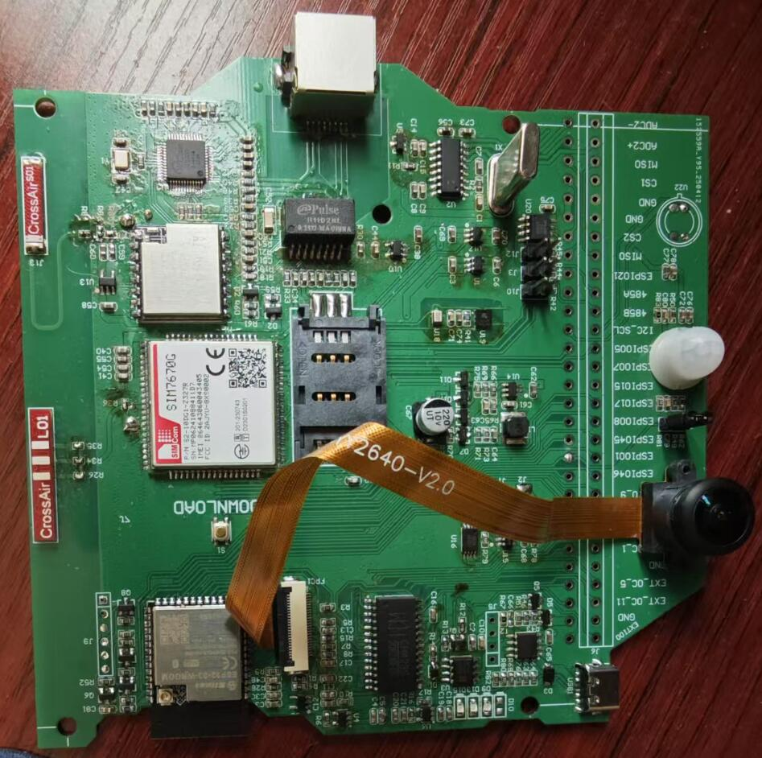

# 项目介绍

我司在嵌入式研发生产和IOT平台建设方面有20多年的经验，综合众多客户的需求，我们推出了此开源硬件设备。
大多数时候客户开始一个项目都需要先行验证，为此我们将尽可能多的传感器，联网模块，供电方式等集中搭载在一个产品上，并提供在线编程和烧录等快捷方式，让客户可以迅速低成本验证自己的想法。
当然，当客户真正需要量产设备时，需要对多余的器件进行裁剪，做到恰好满足自己要求，器件选择不多不少，做到成本极致，客户可以自行裁剪设计或者委托我司设计生产。



## 传感器

温度，湿度，气压，热成像，摄像头（广角，鱼眼，红外等多种镜头），PIR，超声波测距，光辐射强度

## 网络

WIFI，以太网，4G Cat1（全球制式和中国大陆制式），BLE，LORA点对点（专属PA放大，通讯10公里以上）

## 接口

I2C，I2S，UART，SPI，485，GPIO

## ADC

12bits和2路16bits

## 运动部件

2自由度云台

## 供电

适配器供电，可充电电池供电，一次性电池供电，适配器+电池双供电


## 安装步骤

### 准备工具

安装Git，从这里选择自己平台适合的git版本 https://git-scm.com/downloads 为了方便，安装完毕要把git加到执行环境变量中。
安装Python，从这里选择自己平台适合的git版本 https://www.python.org/ 为了方便，安装完毕要把python，pip加到执行环境变量中。

   
### 使用镜像下载idf

以下要在git bash窗口执行，power shell或windows cmd不可以。
git 支持使用类似如下命令将仓库的 URL 进行替换：

```
:: 进入或创建一个安装目录（假设你的工作目录是 /d/project/datacollection/temp1）
cd /d/project/datacollection/temp1

:: 从 Gitee 克隆 ESP-IDF 的镜像工具 esp-gitee-tools 到本地
git clone https://gitee.com/EspressifSystems/esp-gitee-tools.git

:: 设置 Git 镜像替换规则：
:: 所有对 https://github.com/espressif/esp-idf 的请求
:: 将被自动替换为 https://jihulab.com/esp-mirror/espressif/esp-idf
:: 这样可以加快克隆速度（使用国内镜像）
git config --global url.https://jihulab.com/esp-mirror/espressif/esp-idf.insteadOf https://github.com/espressif/esp-idf

:: 运行 jihu-mirror.sh 脚本，正式启用镜像配置
./esp-gitee-tools/jihu-mirror.sh set

:: 使用镜像方式克隆 ESP-IDF 源码（会自动走上面配置的镜像），并进入 v5.3.3 分支
:: --recursive 表示同时克隆所有子模块
git clone -b v5.3.3 --recursive https://github.com/espressif/esp-idf.git

:: 进入 esp-gitee-tools 目录，准备运行其提供的安装脚本
cd esp-gitee-tools

:: 执行 install.sh 脚本，并指定 ESP-IDF 的路径进行环境安装
:: 此脚本会自动安装 ESP-IDF 所需的工具链、依赖库等
./install.sh /d/project/datacollection/temp1/esp-idf

:: 安装完成后，你可能还需要执行 export.sh 来激活环境变量
:: source /d/project/datacollection/temp1/esp-idf/export.sh

```

当我们使用命令 `git clone https://github.com/espressif/esp-idf` 时，默认的 URL `https://github.com/espressif/esp-idf` 将被自动替换成 `https://jihulab.com/esp-mirror/espressif/esp-idf`。


可以使用命令 `./jihu-mirror.sh set` 使用镜像的 URL。

可以使用命令 `./jihu-mirror.sh unset` 恢复，不使用镜像的 URL。

### 配置idf

以下在windows命令窗口执行 (win+r,输入cmd.exe)

```
cd D:\project\datacollection\temp1\esp-idf
```

设置源

```
pip config set global.index-url http://mirrors.aliyun.com/pypi/simple
pip config set global.trusted-host mirrors.aliyun.com
install.bat
export.bat
```