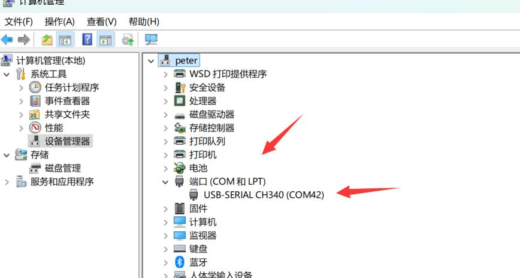
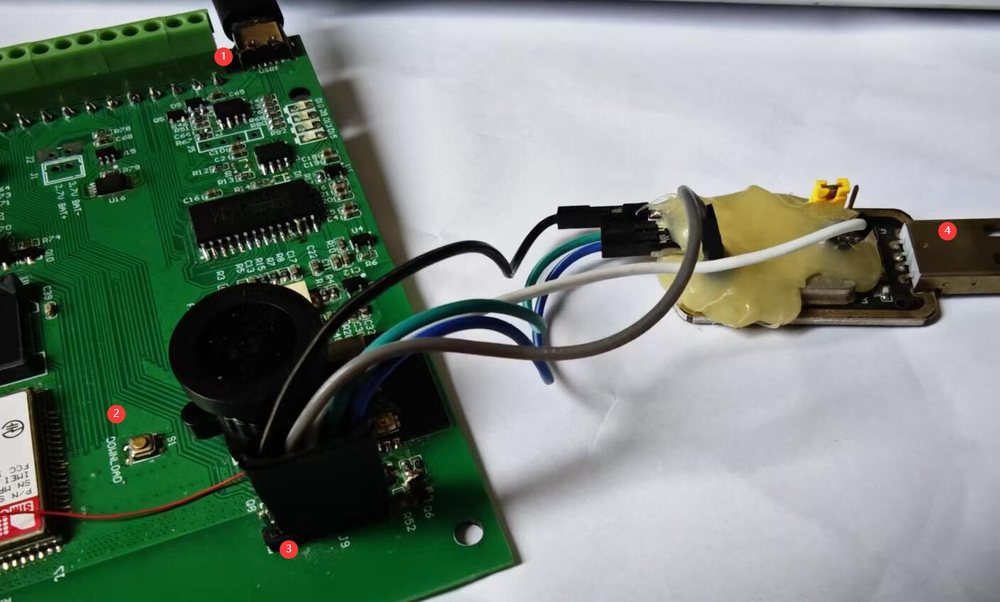

[中文](./README_CN.md)

# Consult

  www.zhiyince.com  market@zhiyince.com  WeChat：laofuaifaming
  
# Project Introduction

Our company has over 20 years of experience in embedded R&D, production, and IoT platform development. Based on extensive customer feedback, we have developed this open-hardware device.

Most customers need to perform rapid validation before starting a new project. To support this, we have integrated as many core components as possible — including various sensors, connectivity modules, and power options — into a single product. We also provide online programming and flashing capabilities to help customers validate their ideas quickly and at minimal cost.

When customers are ready for mass production, redundant components can be trimmed based on actual needs — ensuring the design includes just enough components to meet functional requirements while minimizing costs. Customers can either optimize the design themselves or commission us to assist with customized development and manufacturing.


## Sensors

- Temperature, humidity, barometric pressure  
- Thermal imaging  
- Camera (supports wide-angle, fisheye, infrared, and other lenses)  
- PIR (Passive Infrared) sensor  
- Ultrasonic distance measurement  
- Light radiation intensity detection  

## Connectivity

- Wi-Fi  
- Ethernet  
- 4G Cat1 (supports both global and China Mainland standards)  
- BLE (Bluetooth Low Energy)  
- LoRa point-to-point communication (with dedicated PA amplifier, communication range up to 10 km or more)  

## Interfaces

- I²C, I²S, UART, SPI, RS485, GPIO  

## ADC

- Multi 12-bit ADC  
- 2 x 16-bit ADC  

## Moving Parts

- 2-axis gimbal  

## Power Options

- Adapter-powered  
- Rechargeable battery-powered  
- Disposable battery-powered  
- Dual power supply: adapter + battery  

---

## Installation Guide

> **Tip:** The platform provides an online compilation and flashing feature, which is very convenient. New users are recommended to try the online method first. If you choose the online method, you do not need to read the following local setup instructions.

### Required Tools

Please install the following tools:

- Git: [Download here](https://git-scm.com/downloads)  
  After installation, add `git` to your system PATH environment variable for global access.
  
- Python: [Download here](https://www.python.org/)  
  After installation, add both `python` and `pip` to your system PATH environment variable.

---

### Download ESP-IDF

> **Note:** The following steps must be executed in a **Windows Command Prompt** (Win+R → type `cmd.exe`)

```bash
# Enter or create an installation directory (example path: D:\project\datacollection\temp1)
cd D:\project\datacollection\temp1

# Clone ESP-IDF source code using the mirror and switch to v5.3.2 branch
# --recursive means all submodules will also be cloned
git clone -b v5.3.2 --recursive https://github.com/espressif/esp-idf.git

```
---

### Configure ESP-IDF

> **Note:** The following steps must be executed in a **Windows Command Prompt** (Win+R → type `cmd.exe`)

```bash
# Navigate to IDF directory
cd D:\project\datacollection\temp1\esp-idf

# Run install.bat script
install.bat

# Export environment variables
export.bat

# Modify SPI default level setting
# Edit the following file and change 0 to 1, then save:
# File path:
# D:\project\datacollection\temp1\esp-idf\components\hal\spi_hal.c

#if SPI_LL_MOSI_FREE_LEVEL 
    // Change default data line level to low which same as esp32
    spi_ll_set_mosi_free_level(hw, 1);  // changed to 1, original was 0
#endif
```

---

### Build the Project

> **Note:** The following steps must be executed in a **Windows Command Prompt** (Win+R → type `cmd.exe`)

```bash
# Navigate to working directory
cd D:\project\datacollection\temp1

# Run export.bat to set environment variables
.\esp-idf\export.bat

# Clone the project code
git clone https://gitee.com/aiotfactory/dc01-esp32.git

# Enter project directory and build
cd dc01-esp32
idf.py build
```

---

### Flashing the Firmware

Do not close the terminal after building. If you have exited, re-run `export.bat` and navigate back to the `dc01-esp32` directory before continuing.

Plug the programmer into your computer's USB port. On first connection, the driver will install automatically. Once installed, check Device Manager to confirm successful recognition and note the current COM port number (it may change each time you reconnect, so always double-check).



As shown in the image below, the red-marked button labeled **2** is the flashing mode toggle. Press and hold it before powering on the device. Label **1** is the power interface, **3** is the wiring connection point — ensure correct wiring order. If loose, press firmly before starting flashing. Label **4** connects to the PC.



```bash
# Operation flow: Press flash button → power on → run the command below
# If failed, try several times
idf.py -p COM42 flash monitor
```