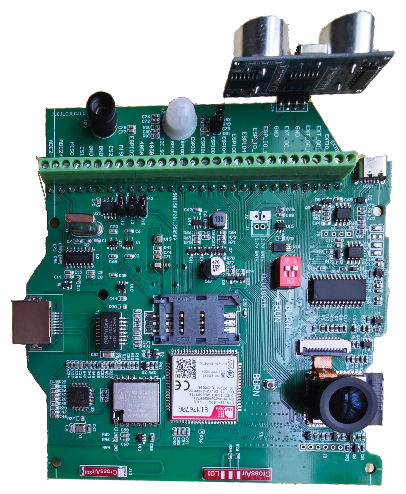
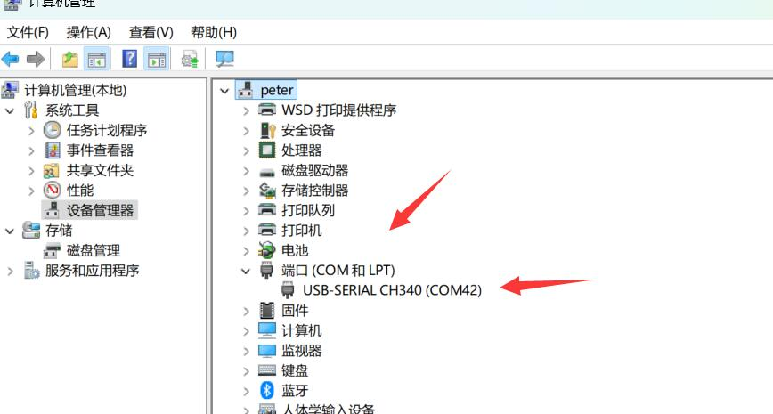
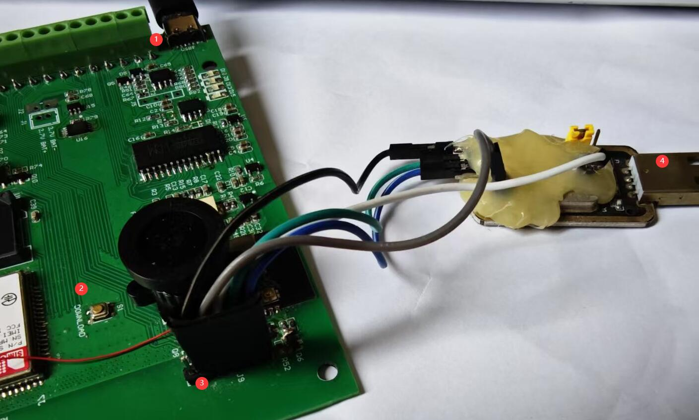

[English](./README.md)

# 咨询

  www.zhiyince.com  market@zhiyince.com  V：laofuaifaming
  
# 项目介绍

我司在嵌入式研发生产与 IoT 平台建设方面拥有超过 20 年的经验。基于众多客户的需求反馈，我们推出了这款开源硬件设备。

大多数客户在启动新项目时都需要先进行快速验证。为此，我们在一个产品中集成了尽可能多的传感器、联网模块、多种供电方式等核心组件，并提供在线编程与烧录等功能，帮助客户以最低成本快速验证想法。

当客户进入量产阶段时，可根据实际需求对冗余器件进行裁剪，做到“不多不少”，精准满足功能要求并实现极致成本控制。客户可自行完成设计优化，也可委托我司协助完成定制化开发与生产。



## 传感器

- 温度、湿度、气压
- 热成像
- 摄像头（支持广角、鱼眼、红外等多种镜头）
- PIR（被动红外）传感器
- 超声波测距
- 光辐射强度检测

## 网络连接

- Wi-Fi
- 以太网
- 4G Cat1（支持全球及中国大陆制式）
- BLE（蓝牙低功耗）
- LoRa 点对点通信（配备专用 PA 放大器，通讯距离可达 10 公里以上）

## 接口

- I²C、I²S、UART、SPI、RS485、GPIO

## ADC

- 多 路 12 位 ADC
- 2 路 16 位 ADC

## 运动部件

- 2 自由度云台

## 供电方式

- 适配器供电
- 可充电电池供电
- 一次性电池供电
- 适配器 + 电池双供电模式

---

## 安装步骤

> **提示：** 平台已提供在线编译与烧录功能，使用便捷，建议新用户优先尝试在线方式。选择在线方式后无需阅读以下本地配置内容。

### 准备工具

请安装以下工具：

- Git：[下载地址](https://git-scm.com/downloads)  
  安装完成后，请将 `git` 添加到系统环境变量 PATH 中以便全局调用。
  
- Python：[下载地址](https://www.python.org/)  
  安装完成后，请将 `python` 和 `pip` 添加到系统环境变量 PATH 中。

---

### 下载 ESP-IDF

> **注意：** 以下操作需在 **Git Bash** 中执行，PowerShell 或 Windows CMD 不支持部分命令。

Git 支持通过配置替换仓库 URL，从而使用国内镜像加速克隆过程。以下是具体操作：

```bash
# 进入或创建安装目录（示例路径为 D:\project\datacollection\temp1）
cd /d/project/datacollection/temp1

# 从 Gitee 克隆 ESP-IDF 镜像工具 esp-gitee-tools
git clone https://gitee.com/EspressifSystems/esp-gitee-tools.git

# 设置 Git 镜像替换规则
# 所有对 GitHub 上 esp-idf 的请求将自动替换为 Jihulab 的镜像地址
git config --global url.https://jihulab.com/esp-mirror/espressif/esp-idf.insteadOf https://github.com/espressif/esp-idf

# 启用镜像配置
./esp-gitee-tools/jihu-mirror.sh set

# 使用镜像克隆 ESP-IDF 源码（会自动走上面配置的镜像），切换到 v5.3.2 分支
# --recursive 表示同时克隆所有子模块
git clone -b v5.3.2 --recursive https://github.com/espressif/esp-idf.git

# 进入 esp-gitee-tools 目录，准备运行安装脚本
cd esp-gitee-tools

# 执行 install.sh 脚本，指定 ESP-IDF 安装路径
./install.sh /d/project/datacollection/temp1/esp-idf
```

如需恢复使用官方原始地址，可执行：
```bash
./jihu-mirror.sh unset
```

---

### 配置 ESP-IDF

> **注意：** 以下操作需在 **Windows 命令行窗口** 中执行（Win+R → 输入 `cmd.exe`）

```bash
# 进入 IDF 目录
cd D:\project\datacollection\temp1\esp-idf

# 设置 pip 国内源（阿里云）
pip config set global.index-url http://mirrors.aliyun.com/pypi/simple
pip config set global.trusted-host mirrors.aliyun.com

# 安装依赖
install.bat

# 导出环境变量
export.bat

# 修改 SPI 默认电平设置
# 编辑以下文件，将第 0 行改为 1，保存文件
# 文件路径：
# D:\project\datacollection\temp1\esp-idf\components\hal\spi_hal.c

#if SPI_LL_MOSI_FREE_LEVEL 
    // Change default data line level to low which same as esp32
    spi_ll_set_mosi_free_level(hw, 1);  // 改为 1，原值是 0
#endif
```

---

### 编译项目

> **注意：** 以下操作需在 **Windows 命令行窗口** 中执行（Win+R → 输入 `cmd.exe`）

```bash
# 进入工作目录
cd D:\project\datacollection\temp1

# 执行 export.bat 设置环境变量
.\esp-idf\export.bat

# 下载项目代码
git clone https://gitee.com/aiotfactory/dc01-esp32.git

# 进入项目目录并编译
cd dc01-esp32
idf.py build
```

---

### 烧录固件

编译完成后，请勿关闭终端。若已退出，请重新运行 `export.bat`，并进入项目目录 `dc01-esp32` 再继续操作。

将烧录器插入电脑 USB 接口，首次连接会自动安装驱动。安装完成后，请通过设备管理器确认是否识别成功，并记录当前 COM 端口号（每次插拔可能变化，务必重新确认）。



如下图所示，红色标记 **2** 是烧录模式切换按钮，在上电前请按住该按钮。标记 **1** 为电源接口，**3** 为烧录接线处，请注意接线顺序；若接触不良，请按压后再开始烧录。标记 **4** 用于连接电脑。



```bash
# 操作流程：先按住烧录按钮 → 上电 → 执行以下命令
# 若失败，请多尝试几次
idf.py -p COM42 flash monitor
```
